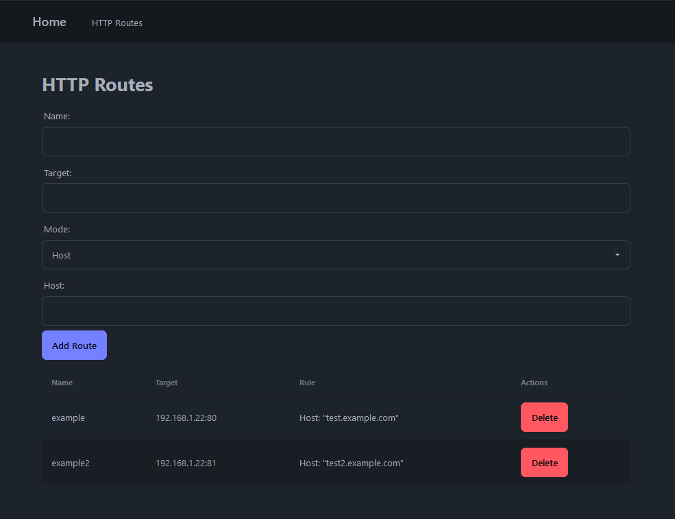
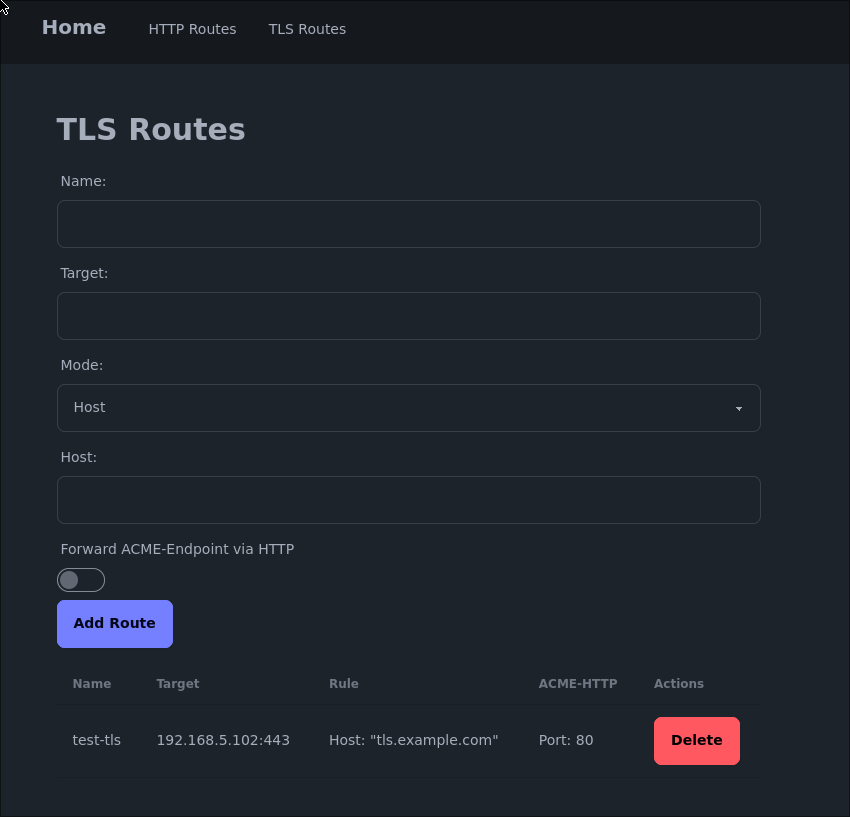

# Traefik-GUI

This project is a Web-GUI for the [Traefik](https://traefik.io/traefik/) reverse proxy.
It allows you to easily add routes to your **dynamic** Traefik configuration.

It is meant for simple http and tcp routes, without having to manage the Traefik configuration manually.

This is especially useful if you only have terminal access.

It is currently in development and not ready for production use.





# Features

Currently, Traefik-gui has the following features:

Forward HTTP-Request:
- Via Hostname
- Via raw traefik rule

Forward TLS-Connections
- Via HostSNI
- Via HostSNI regex

When adding a TLS-Route you, may also enable forwarding of the ACME-HTTP01 challenge to automatically create a router to the `/.well-known/acme-challenge/` endpoint used by let's encrypt.

# Installation

Traefik-GUI can be installed using docker:

```shell
docker pull ghcr.io/rahn-it/traefik-gui
docker run -d -p 3000:3000 --name traefik-gui -v ./data:/app/data -v ./traefik-configs:/app/traefik ghcr.io/rahn-it/traefik-gui
```

I would recommend using docker-compose though.

As a starting point you can use the [docker compose file](docker-compose.yaml) frm this repository.
Don't forget to enter your email. The example will spin up the traefik dashboard on port 8080


# Usage

You can access the GUI at port 3000. e.g.: `http://localhost:3000`

The tool will automatically generate the Traefik configuration and put it in the `/app/traefik` folder inside the container.

When using the docker compose example, this folder will already be connected to the traefik container.

If you have any questions or problems, feel free to create an issue.

# Attribution

This project is licensed under the [AGPL-3.0](LICENSE).

The development and hosting was kindly sponsored by [Rahn IT](https://it-rahn.de/).

Thanks to the great people of [Traefik](https://traefik.io/), [SvelteKit](https://kit.svelte.dev/) and everyone who made this possible.
